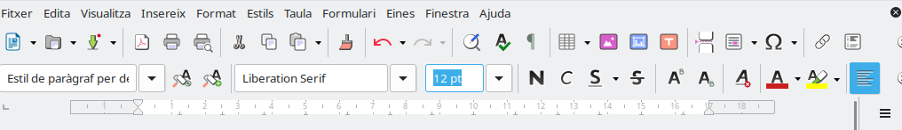
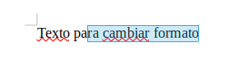
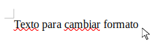
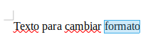
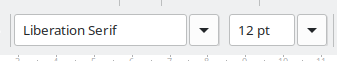
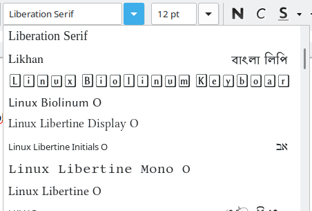
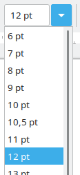

En esta sesión aprenderemos a cambiar el aspecto de un texto utilizando las herramientas básicas de formato de Writer.

Trabajaremos con:

- La selección de texto.
- El tipo de letra.
- El tamaño de la letra.
- La negrita.
- La cursiva.
- El subrayado.
- La combinación de varios formatos.
- La corrección de cambios no deseados.

> **Objetivo:** conseguir que un documento sea más claro, ordenado y fácil de leer.

!!! salto-pagina-pdf ""

## 6.1. ¿Qué es el formato de un texto?

El formato es el conjunto de cambios que realizamos sobre el aspecto de un texto.

Por ejemplo, podemos cambiar:

- El tipo de letra.
- El tamaño.
- El grosor.
- La inclinación.
- El subrayado.

Aplicar formato no cambia lo que dice el texto. Únicamente modifica su apariencia.

!!! example "**Ejemplo:**"

    Texto sin formato: Este es el título de mi evento.

    Texto con formato: **ESTE ES EL TÍTULO DE MI EVENTO**

Las palabras son parecidas, pero el segundo texto destaca mucho más.

!!! salto-pagina-pdf ""

## 6.2. Seleccionar antes de cambiar

Para aplicar un formato a una palabra o a una frase, primero debemos seleccionarla.

### ¿Cómo seleccionamos un texto?

1. Colocamos el puntero antes de la primera letra.

2. Pulsamos el botón izquierdo del ratón.
3. Sin soltar el botón, arrastramos hasta el final.

4. Soltamos el botón.

El texto seleccionado aparecerá marcado con un color diferente.

> **Recuerda:** si no seleccionamos el texto, el cambio se aplicará a lo que escribamos a continuación.

### Seleccionar una palabra rápidamente

También podemos seleccionar una palabra haciendo doble clic sobre ella.

Este procedimiento es útil cuando solo queremos cambiar el formato de una palabra.

!!! salto-pagina-pdf ""

## 6.3. El tipo de letra

El tipo de letra también recibe el nombre de **fuente**.

Cada fuente representa las letras con un diseño diferente.

Algunos ejemplos habituales son:

- Arial.
- Liberation Sans.
- Calibri.
- Times New Roman.
- Verdana.

Para cambiar el tipo de letra:

1. Seleccionamos el texto.

2. Abrimos la lista de fuentes de la barra de herramientas.

3. Elegimos la fuente deseada.

> **Consejo:** utiliza letras sencillas y fáciles de leer. No es conveniente utilizar muchos tipos de letra diferentes en un mismo documento.

## 6.4. El tamaño de la letra

El tamaño indica si una letra se verá más grande o más pequeña.

El tamaño se mide en **puntos** y aparece representado mediante un número.

Algunos tamaños habituales son:

| Elemento { .table-main-column .table-cl-secundario .table-bg-principal } | Tamaño recomendado { .table-full-container .table-cl-secundario .table-bg-principal } |
|---|:---:|
| Texto normal | 11 o 12 |
| Datos importantes | 12 o 14 |
| Subtítulos | 14 o 16 |
| Títulos | 18, 20 o 24 |

Para cambiar el tamaño:

1. Seleccionamos el texto.

2. Pulsamos sobre el cuadro del tamaño.

3. Elegimos o escribimos el número.
4. Pulsamos la tecla `Intro`.

### Ejemplo de organización

- Título principal: tamaño 20.
- Subtítulo: tamaño 16.
- Texto de los párrafos: tamaño 12.
- Frase final destacada: tamaño 14.

Utilizar diferentes tamaños nos ayuda a reconocer qué partes del documento son más importantes.

## 6.5. La negrita

La **negrita** hace que las letras aparezcan más gruesas.

Se representa mediante el botón **N** de la barra de herramientas.

Se utiliza para destacar:

- Títulos.
- Palabras importantes.
- Nombres de apartados.
- Datos que deben localizarse rápidamente.

**Ejemplo:**

El evento comenzará a las **diez de la mañana**.

Para aplicar negrita:

1. Seleccionamos el texto.
2. Pulsamos el botón **N**.
3. Comprobamos el resultado.

Para eliminar la negrita, seleccionamos nuevamente el texto y volvemos a pulsar el mismo botón.

> **Importante:** si todo el texto está en negrita, ninguna parte destacará sobre las demás.

!!! salto-pagina-pdf ""

## 6.6. La cursiva

La *cursiva* hace que las letras aparezcan ligeramente inclinadas.

Se representa mediante el botón *C* de la barra de herramientas.

Podemos utilizarla para:

- Destacar una expresión.
- Escribir un lema.
- Señalar el título de una obra.
- Dar énfasis a una palabra.

**Ejemplo:**

El campeonato se desarrollará en un ambiente *seguro y respetuoso*.

Para aplicar cursiva:

1. Seleccionamos el texto.
2. Pulsamos el botón *C*.
3. Comprobamos que las letras aparecen inclinadas.

La cursiva debe utilizarse en fragmentos cortos. Un párrafo completo en cursiva puede resultar difícil de leer.

!!! salto-pagina-pdf ""

## 6.7. El subrayado

El <u>subrayado</u> coloca una línea debajo del texto.

Se representa mediante el botón <u>S</u> de la barra de herramientas.

Podemos utilizarlo para destacar:

- Una fecha importante.
- Una norma.
- Una instrucción.
- Una frase breve.

**Ejemplo:**

Todos los participantes deberán <u>respetar las normas de seguridad</u>.

Para aplicar el subrayado:

1. Seleccionamos el texto.
2. Pulsamos el botón de subrayado.
3. Comprobamos que aparece una línea debajo del texto.

> **Consejo:** no debemos subrayar párrafos completos. El subrayado funciona mejor en palabras o frases cortas.

## 6.8. Combinar diferentes formatos

Una palabra puede tener más de un formato al mismo tiempo.

Por ejemplo:

- **Negrita y tamaño 18.**
- ***Negrita y cursiva.***
- **<u>Negrita y subrayado.</u>**
- ***<u>Negrita, cursiva y subrayado.</u>***

!!! salto-pagina-pdf ""

Para combinar formatos:

1. Seleccionamos el texto.
2. Elegimos el tamaño.
3. Pulsamos los botones de formato que necesitemos.
4. Comprobamos el resultado.

### Ejemplo

***<u>PREPARA TU MOTO Y DISFRUTA DE LA CARRERA</u>***

Esta frase combina:

- Tamaño de letra 14.
- Negrita.
- Cursiva.
- Subrayado.

No debemos combinar todos los formatos continuamente. Solo lo haremos cuando queramos destacar algo especialmente importante.

## 6.9. Activar el formato antes de escribir

También podemos activar un formato antes de comenzar a escribir.

Por ejemplo:

1. Pulsamos el botón de negrita.
2. Escribimos una palabra.
3. Volvemos a pulsar el botón de negrita para desactivarla.

Si olvidamos desactivar el botón, todo lo que escribamos después continuará apareciendo en negrita.

> **Comprueba siempre los botones de la barra de herramientas antes de seguir escribiendo.**

!!! salto-pagina-pdf ""

## 6.10. Corregir un cambio

Si aplicamos un formato incorrecto, podemos corregirlo.

### Primera opción: volver a pulsar el botón

1. Seleccionamos el texto.
2. Pulsamos nuevamente el botón de negrita, cursiva o subrayado.

### Segunda opción: deshacer

Podemos pulsar el botón **Deshacer** para eliminar el último cambio realizado.

Su icono tiene forma de flecha curvada hacia la izquierda.

También podemos utilizar:

`Ctrl + Z`

Esta opción es muy útil cuando:

- Borramos una palabra sin querer.
- Aplicamos un formato incorrecto.
- Cambiamos accidentalmente el tamaño.
- Movemos o modificamos un texto.

## 6.11. ¿Cómo debe quedar un documento claro?

Un documento resulta más fácil de leer cuando mantiene un formato sencillo y ordenado.

Debemos intentar:

- Utilizar uno o dos tipos de letra.
- Escribir el texto normal con tamaño 11 o 12.
- Utilizar tamaños mayores para los títulos.
- Emplear la negrita para destacar información importante.
- Utilizar la cursiva y el subrayado solo en fragmentos cortos.
- Mantener el mismo formato en elementos que cumplen la misma función.
- Revisar el documento antes de terminar.

!!! salto-pagina-pdf ""

## 6.12. Errores habituales

### No seleccionar el texto

El formato se aplica a lo que escribimos después, pero no modifica el texto anterior.

### Dejar activada la negrita

Todo el texto continúa apareciendo en negrita aunque ya no queramos destacarlo.

### Utilizar un tamaño demasiado grande

El texto ocupa demasiado espacio y el documento resulta difícil de leer.

### Utilizar demasiados formatos

Combinar continuamente negrita, cursiva y subrayado puede hacer que el documento parezca desordenado.

### No comprobar el resultado

Después de aplicar un formato debemos observar el documento y comprobar que hemos modificado el texto correcto.

## Resumen

Para aplicar formato correctamente debemos seguir siempre este orden:

1. Seleccionar el texto.
2. Elegir el tipo o el tamaño de letra.
3. Aplicar negrita, cursiva o subrayado.
4. Comprobar el resultado.
5. Corregir los posibles errores.

> **Idea principal:** el formato sirve para organizar la información y destacar lo importante, no para llenar el documento de efectos.