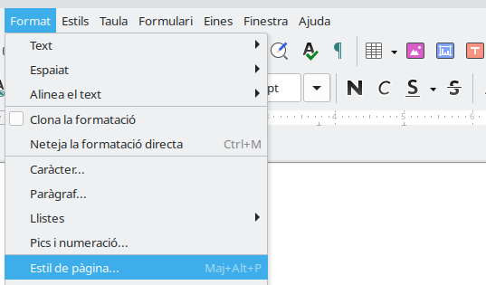
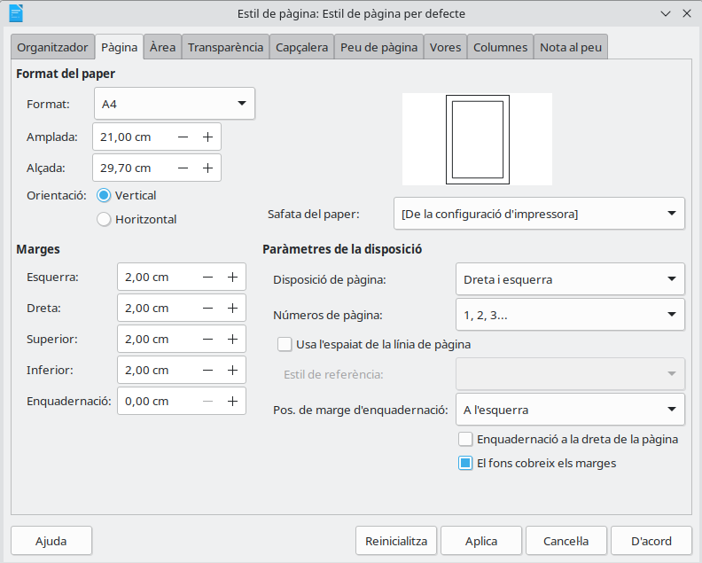

# Configuración básica de la página

## ¿Qué vamos a hacer hoy?

Hoy aprenderemos a preparar la página de un documento antes de empezar a trabajar con él.

Aprenderemos a:

- Comprobar el tamaño de la página.
- Cambiar la orientación de la página.
- Modificar los márgenes.
- Elegir la configuración más adecuada para cada documento.
- Guardar el documento con el nombre indicado.

Después aplicaremos estos cambios al documento de nuestro evento.

## ¿Qué debemos recordar?

Antes de empezar, debemos recordar que:

- Writer sirve para crear y modificar documentos de texto.
- El cursor indica dónde aparecerá el siguiente carácter.
- Los documentos de Writer utilizan normalmente la extensión `.odt`.
- Debemos guardar cada documento en la carpeta indicada.
- El nombre del archivo debe indicar claramente qué contiene.

> **Ejemplo de nombre poco claro:** `documento1.odt`  
> **Ejemplo de nombre claro:** `Cartel_KDD49_Valencia.odt`

## ¿Qué criterio vamos a trabajar?

**CE03-d:** Se han configurado las páginas del documento de acuerdo con las indicaciones propuestas.

En esta actividad trabajaremos principalmente:

- El tamaño de la página.
- La orientación.
- Los márgenes.

---

## 1. La página del documento

Cuando creamos un documento en Writer, escribimos sobre una página.

Antes de trabajar, podemos decidir cómo queremos que sea esa página:

- Su tamaño.
- Su orientación.
- El espacio que quedará alrededor del texto.

Esta configuración dependerá del documento que queramos preparar.

Por ejemplo, un cartel y una carta pueden necesitar configuraciones diferentes.

---

## 2. El tamaño de la página

El tamaño indica las dimensiones que tendrá la página cuando se visualice o se imprima.

El tamaño más utilizado es el **A4**.

Una página A4 mide:

- **21 centímetros de ancho.**
- **29,7 centímetros de alto.**

Normalmente utilizaremos el tamaño A4 para:

- Cartas.
- Trabajos de clase.
- Fichas.
- Informes.
- Programas de actividades.

> Antes de imprimir un documento, debemos comprobar que el tamaño de la página sea correcto.

### Cambiar el tamaño en Writer

1. Abre el menú **Format**.
2. Selecciona **Estil de pàgina**.

    

3. Busca la pestaña **Pàgina**.
4. En la sección **Format del paper**
5. Selecciona **A4**.

    

6. Pulsa **D'acord**.

---

## 3. La orientación de la página

La orientación indica la posición en la que utilizaremos la página.

Existen dos orientaciones principales.

### Orientación vertical

La página es más alta que ancha.

Se utiliza habitualmente para:

- Cartas.
- Informes.
- Fichas.
- Trabajos escritos.
- Portadas.

### Orientación horizontal

La página es más ancha que alta.

También se llama orientación **apaisada**.

Se utiliza habitualmente para:

- Carteles.
- Horarios.
- Calendarios.
- Tablas grandes.
- Programas de eventos.

| Vertical { .table-full-container .table-cl-secundario .table-bg-principal }| Horizontal { .table-full-container .table-cl-secundario .table-bg-principal }|
|:---:|:---:|
| La página es más alta | La página es más ancha |
| Adecuada para textos | Adecuada para carteles y horarios |

### Cambiar la orientación en Writer

1. Abre el menú **Format**.
2. Selecciona **Estil de pàgina**.

    

3. Busca la pestaña **Pàgina**.

    

4. En la sección **Orientació**, selecciona **Vertical** u **Horitzontal**.
5. Pulsa **D'acord**.

> La orientación correcta dependerá del documento que queramos crear.

---

## 4. Los márgenes

Los márgenes son los espacios en blanco que quedan entre el contenido y los bordes de la página.

Una página tiene cuatro márgenes:

- Margen superior.
- Margen inferior.
- Margen izquierdo.
- Margen derecho.

Los márgenes evitan que el texto quede demasiado cerca del borde.

También ayudan a que el documento sea:

- Más claro.
- Más ordenado.
- Más fácil de leer.
- Más fácil de imprimir.

### Cambiar los márgenes en Writer

1. Abre el menú **Format**.
2. Selecciona **Estil de pàgina**.

    

3. Busca la pestaña **Pàgina**.

    

4. Busca la sección **Marges** y escribe la medida indicada.
5. Pulsa **D'acord**

Por ejemplo, podemos utilizar un margen de **2 centímetros** en los cuatro lados.

> No debemos utilizar espacios o la tecla Intro para crear márgenes. Los márgenes se configuran desde las opciones de la página.

---

## 5. ¿Qué configuración debemos elegir?

La configuración depende del documento que estemos preparando.

| Documento { .table-full-container .table-cl-secundario .table-bg-principal} | Tamaño  { .table-cl-secundario .table-bg-principal} | Orientación { .table-full-container .table-cl-secundario .table-bg-principal}|
|---|:---:|:---:|
| Carta | A4 | Vertical |
| Trabajo de clase | A4 | Vertical |
| Cartel de un evento | A4 | Vertical u horizontal |
| Horario | A4 | Horizontal |
| Programa de actividades | A4 | Horizontal |

No existe una única configuración válida para todos los documentos.

Debemos seguir siempre las instrucciones recibidas.

---

## 6. Guardar el documento

Después de modificar la configuración de la página, debemos guardar los cambios.

Podemos utilizar:

**Fitxer → Desa**

También podemos utilizar la combinación:

**Ctrl + S**

Si queremos conservar el documento original y crear otro diferente, utilizaremos:

**Fitxer → Anomena i desa**

Después elegiremos:

1. La carpeta indicada.
2. Un nombre significativo.
3. El formato `.odt`.

---

## Resumen

Antes de trabajar con un documento debemos comprobar:

- El tamaño de la página.
- La orientación.
- Los márgenes.
- La carpeta donde se guardará.
- El nombre del archivo.

> Una página bien configurada permite crear un documento más claro, ordenado y fácil de imprimir.

## Antes de empezar la actividad

Comprueba que puedes responder estas preguntas:

1. ¿Cuál es el tamaño de página más utilizado?
2. ¿Qué diferencia existe entre orientación vertical y horizontal?
3. ¿Qué son los márgenes?
4. ¿Dónde podemos cambiar la configuración de la página?
5. ¿Qué opción utilizamos para crear una copia con otro nombre?