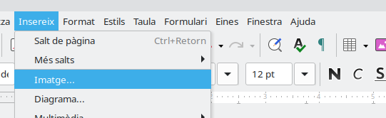
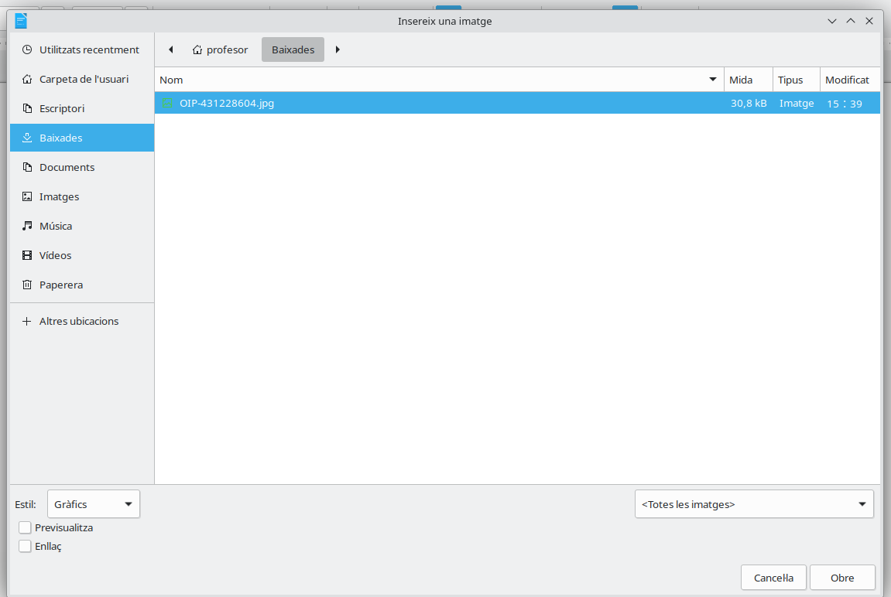

# Insertar imágenes en Writer

En un documento podemos combinar **texto e imágenes**. Las imágenes sirven para presentar la información de una forma más clara, atractiva y fácil de comprender.

En esta sesión aprenderemos a:

- Insertar una imagen guardada en el ordenador.
- Cambiar su tamaño.
- Moverla por el documento.
- Elegir cómo se coloca el texto alrededor de la imagen.
- Guardar correctamente el documento.

---

## 1. Insertar una imagen

Para añadir una imagen en LibreOffice Writer:

1. Coloca el cursor en el lugar donde quieres insertar la imagen.
2. Pulsa **Insereix**.
3. Selecciona **Imatge**.

    

4. Busca la carpeta donde está guardada.

    

5. Selecciona la imagen.
6. Pulsa **Obrir**.

La imagen aparecerá dentro del documento.

> **Importante:** antes de empezar, debemos saber en qué carpeta está guardada la imagen.

---

## 2. Seleccionar una imagen

Para modificar una imagen, primero debemos **seleccionarla**.

Haz clic una vez sobre ella. Al seleccionarla, aparecerán unos pequeños cuadrados alrededor de la imagen.

Estos cuadrados reciben el nombre de **controladores de tamaño**.

---

## 3. Cambiar el tamaño

Podemos hacer que una imagen sea más grande o más pequeña.

1. Selecciona la imagen.
2. Coloca el ratón sobre uno de los cuadrados de las esquinas.
3. Mantén pulsado el botón izquierdo.
4. Arrastra el ratón hasta conseguir el tamaño deseado.

> **Recuerda:** utiliza preferentemente los cuadrados de las **esquinas** para evitar que la imagen quede deformada.

### Imagen proporcionada

La imagen mantiene correctamente su forma.

### Imagen deformada

La imagen aparece demasiado ancha o demasiado alta.

> Una imagen grande no siempre queda mejor. Debe permitir leer el texto y mantener el documento ordenado.

---

## 4. Mover una imagen

Para mover una imagen:

1. Selecciona la imagen.
2. Coloca el ratón en el centro.
3. Mantén pulsado el botón izquierdo.
4. Arrástrala hasta el lugar deseado.

Si no puedes moverla libremente, tendrás que cambiar su **ajuste**.

---

## 5. Ajustar el texto alrededor de la imagen

El ajuste indica cómo se coloca el texto respecto a la imagen.

Para cambiarlo:

1. Selecciona la imagen.
2. Pulsa sobre ella con el botón derecho.
3. Selecciona **Ajuste**.
4. Elige una opción.

### Sin ajuste

El texto se coloca únicamente por encima y por debajo de la imagen.

Esta es la opción más sencilla para empezar.

### Ajuste paralelo

El texto puede aparecer a los lados de la imagen.

Esta opción permite aprovechar mejor el espacio, pero hay que comprobar que el texto siga siendo fácil de leer.

> Para esta actividad utilizaremos principalmente **sin ajuste** y **ajuste paralelo**.

---

## 6. Colocar la imagen en el centro

Una forma sencilla de ordenar el documento es colocar la imagen en una línea independiente y centrarla.

1. Selecciona la imagen.
2. Pulsa el botón **Centrar** de la barra de herramientas.

La imagen quedará situada en el centro de la página.

---

## 7. Eliminar una imagen

Si has insertado una imagen incorrecta:

1. Selecciona la imagen.
2. Pulsa la tecla **Supr**.

También puedes utilizar **Deshacer** si acabas de insertarla o modificarla.

---

## 8. Guardar el documento

Cuando termines:

1. Pulsa **Fitxer → Desa**.
2. Comprueba que el documento está dentro de tu carpeta.
3. Utiliza el nombre indicado en la actividad.
4. Comprueba que el archivo termina en **`.odt`**.

También puedes guardar rápidamente pulsando:

**Ctrl + S**

> Guarda el documento varias veces mientras trabajas. No esperes al final de la clase.

---
