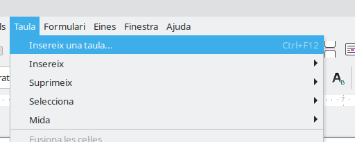
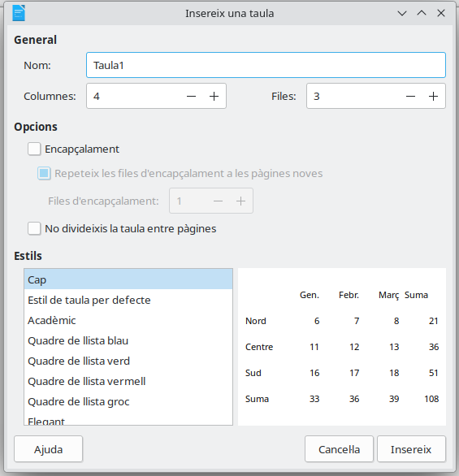
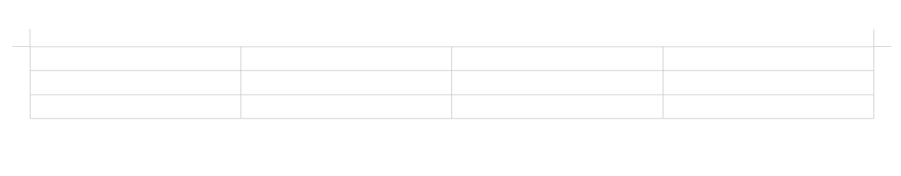
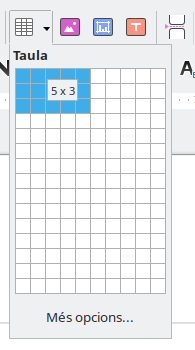

# Crear tablas en Writer

Una **tabla** permite organizar la información en filas y columnas.

Podemos utilizar una tabla para mostrar:

- Horarios.
- Participantes.
- Clasificaciones.
- Precios.
- Resultados.
- Actividades de un evento.

---

## 1. Partes de una tabla

Una tabla está formada por **filas**, **columnas** y **celdas**.

| Participante { .table-full-container .table-cl-secundario .table-bg-principal}  | Actividad { .table-cl-secundario .table-bg-principal }| Hora { .table-main-column .table-cl-secundario .table-bg-principal} |
|---|---|---|
| Equipo Azul | Primera prueba | 17:00 |
| Equipo Rojo | Segunda prueba | 17:30 |

### Fila

Es un conjunto de celdas colocadas horizontalmente.

En el ejemplo, cada participante ocupa una fila.

### Columna

Es un conjunto de celdas colocadas verticalmente.

En el ejemplo tenemos tres columnas:

1. Participante.
2. Actividad.
3. Hora.

### Celda

Es cada uno de los espacios de la tabla.

En una celda podemos escribir texto, números o fechas.

> Antes de crear una tabla debemos pensar cuántas filas y columnas necesitamos.

---

## 2. Insertar una tabla

Para crear una tabla en LibreOffice Writer:

1. Coloca el cursor en el lugar donde quieres crearla.
2. Pulsa **Tabla**.
3. Selecciona **Insertar tabla**.
    
    

4. Indica el número de columnas.
5. Indica el número de filas.
    
    

6. Pulsa **Aceptar**.

    

También podemos utilizar el botón **Insertar tabla** de la barra de herramientas.

---

## 3. Escribir dentro de una tabla

Para escribir dentro de una celda:

1. Haz clic en la celda.
2. Escribe el contenido.
3. Pulsa la tecla **Tabulador** para pasar a la siguiente celda.

Cuando llegues a la última celda, la tecla **Tabulador** puede crear una nueva fila.

> Para pasar de una celda a otra utilizamos el **Tabulador**, no la barra espaciadora.

---

## 4. Seleccionar una celda

Antes de cambiar el aspecto de una celda, debemos seleccionarla.

Podemos seleccionar:

- Una sola celda.
- Una fila completa.
- Una columna completa.
- Toda la tabla.

Para hacerlo:

1. Haz clic dentro de la tabla.
2. Abre el menú **Tabla**.
3. Pulsa **Seleccionar**.
4. Elige **Celda**, **Fila**, **Columna** o **Tabla**.

---

## 5. Añadir una fila

Si necesitamos escribir más información, podemos añadir una fila.

1. Haz clic dentro de la tabla.
2. Abre el menú **Tabla**.
3. Selecciona **Insertar**.
4. Pulsa **Filas**.

También podemos situarnos en la última celda y pulsar **Tabulador**.

---

## 6. Eliminar una fila

Si una fila no es necesaria:

1. Haz clic en una celda de esa fila.
2. Abre el menú **Tabla**.
3. Selecciona **Eliminar**.
4. Pulsa **Filas**.

> Antes de eliminar una fila, comprueba que has seleccionado la correcta.

---

## 7. Cambiar el ancho de una columna

Podemos hacer que una columna sea más ancha o más estrecha.

1. Coloca el ratón sobre la línea que separa dos columnas.
2. Espera a que cambie la forma del puntero.
3. Mantén pulsado el botón izquierdo.
4. Arrastra la línea.

Las columnas deben tener espacio suficiente para que el contenido se pueda leer.

---

## 8. Dar formato al texto de una tabla

El texto situado dentro de una tabla se puede modificar igual que cualquier otro texto.

Podemos aplicar:

- **Negrita**.
- *Cursiva*.
- Subrayado.
- Tamaño de letra.
- Alineación izquierda.
- Alineación centrada.
- Alineación derecha.

Normalmente, la primera fila contiene los títulos de las columnas.

Por eso podemos colocarla:

- En **negrita**.
- Centrada.
- Con un color de fondo diferente.

---

## 9. Centrar el contenido

Para centrar el contenido de una o varias celdas:

1. Selecciona las celdas.
2. Pulsa el botón **Centrar**.

No debemos utilizar espacios para centrar el contenido.

---

## 10. Guardar el documento

Cuando termines:

1. Pulsa **Archivo → Guardar**.
2. Comprueba el nombre del documento.
3. Comprueba que está dentro de tu carpeta.
4. Verifica que termina en **`.odt`**.

También puedes guardar pulsando:

**Ctrl + S**

---

## Errores que debemos evitar

- Crear demasiadas filas o columnas.
- Utilizar espacios para separar la información.
- Escribir fuera de la celda correspondiente.
- Dejar columnas demasiado estrechas.
- Eliminar una fila sin comprobar cuál está seleccionada.
- Crear varias tablas cuando podemos utilizar una sola.
- Olvidar guardar el documento.

---

## Antes de terminar, comprueba

- [ ] La tabla tiene las filas solicitadas.
- [ ] La tabla tiene las columnas solicitadas.
- [ ] He escrito cada dato en su celda.
- [ ] La primera fila está en negrita.
- [ ] El contenido se puede leer correctamente.
- [ ] No he utilizado espacios para organizar los datos.
- [ ] He guardado el documento en formato `.odt`.
- [ ] El documento está dentro de mi carpeta.

---

## Resumen

Para trabajar con una tabla debemos:

1. Pensar cuántas filas y columnas necesitamos.
2. Insertar la tabla.
3. Escribir cada dato en su celda.
4. Utilizar el tabulador para avanzar.
5. Aplicar un formato sencillo.
6. Guardar el documento.

> Una tabla debe ayudar a encontrar y comparar la información rápidamente.